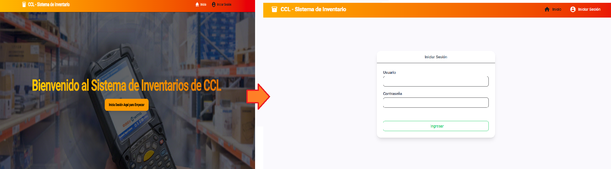

# Prueba-Tecnica-CCL

Creación de repositorio Github para la realización de la prueba técnica del MiniSistema de Gestión de Inventario CCL

##### Pasos para iniciar el Proyecto

# Base de Datos - Postegresql

Para creear la Base de Datos (CCL.DB.sql) debe descargar el archivo cargado en Github y abrir la consola psql (terminal de Postgress SQL) debe ingresar los datos de acceso al servidor y ejecutar el siguiente comando en la terminal ``` \i 'C:/Ruta Ubicación Archivo SQL/CCL_DB.sql' ```. De Esta manera se crea la Base de Datos del proyecto.

# Aplicación - Servidor Backend (C#)

Antes de ejecutar el backend de la aplicación que está alojada en la carpeta "CCL-Server" debe realizar los siguientes pasos.

1. Modificar el Default Connection del archivo `appsettings.json` la conexión de la base de datos, en el cual debe configurar la cadena de conexion de la siguiente manera.

```csharp
"ConnectionStrings": {
  "DefaultConnection": "Server=Servidor_De_BD;Database=ccl_database;User Id=Usario_Que_Conecta;Password=Contraseña_De_Usuario;TrustServerCertificate=True"
}
```

2. Garantizar que los "OrigenesPermiridos" dentro del archivo `aappsettings.Development.json` indique correctamente el nombre del servidor y el puerto del servidor de la aplicación cliente que se ejecutará para evitar el conflicto de origenes desconocidos por el CORS. 

Ej:

```csharp
{
  "Logging": {
    "LogLevel": {
      "Default": "Information",
      "Microsoft.AspNetCore": "Warning"
    }
  },
  "OrigenesPermitidos": "http://localhost:4200" /// Ruta Servidor Cliente - Modificar el Puerto si al Ejecutar el Cliente Angular Modifica los Puertos. 
}
```

3. Con los puntos anteriores ya configurados se procede a ejecutar la aplicación desde el IDE .NET de preferencia abriendo el archivo  `CCL-Server.slnx` o ejecutando el comando ```dotnet run``` en la terminal desde la ruta principal donde se encuentra la aplicación backend `C:\RutaAplicacion\CCL-Server\CCL-Server`.

# Aplicación - Servidor FrontEnd (Angular)

Para el funcionamiento visual de la aplicación (FrontEnd) debe primeramente garantizar que la ruta de conexión con el servidor backend sea la correcta. Debe abrir el archivo `environment.development.ts` y rectificar que tanto el servidor como el puerto del backend esté siendo bien redireccionado.

Ej:

```TS
export const environment = {
    apiURL: 'https://localhost:7191/' /// Dirección del Servidor y Puerto del Backend
};

```

Con esto ya configurado se debe ingresar a la terminal (CMD) a la ruta principal del proyecto Angular (CCL-Client) y ejecutar el comando `ng serve` seguidamente abre la ruta web para ingresar a la aplicación y realizar las pruebas correspondientes.

# Vista Inicial de la Aplicación

Cuando se inicia la aplicación el primer apartado a visualizar es una pagina invitando el usuario iniciar sesión (si no se inicia sesión no se podrá acceder al sistema de inventarios).



En el inicio de sesión solo existen dos usuarios autorizados para ingresar a la aplicación, los cuales son:

$${\color{#BA2B11} Usuario \space ADMIN}$$

Este usuario permite consultar el inventario y cuenta con todas las acciones disponibles para registrar, modificar o eliminar un producto.

**Usuario:** CCL204

**Clave:** Access26*

$${\color{#D1B71D} Usuario \space VIEWER}$$

Este usuario al igual que el usuario **ADMIN** permite consultar el inventario de los productos, sin embargo no cuenta con las acciones requeridas para manipular la información (registrar, modificar y eliminar).

**Usuario:** CCL205

**Clave:** Access26*

Si se intenta ingresar con un usuario inexistente el mismo sistema denegara el acceso hasta que ingrese el usuario y contraseña correspondiente.

Adicionalmente el sistema cuenta con un tiempo expiración de sesión de 10 minutos, cuando finalice el tiempo, el usuario debera volver a iniciar sesión para seguir operando en el sistema.

**Nota:** Si desea prolongar o disminuir el tiempo de expiración de las sesiones puede modificar el archivo `appsettings.json` de la carpeta CCL-Server, mas especificamente se modifica el siguiente comando.

```csharp

"Jwt": {
  ...
  "ExpiresInMinutes": 10 //Tiempo de expiración en Minutos
}
```

# Caracteristicas a Tener en Cuenta

V18.3


V13


NET Core V9.0


V21.2


Bearer Token


V2.53

